# ***Super Mario: Lost Kingdoms***

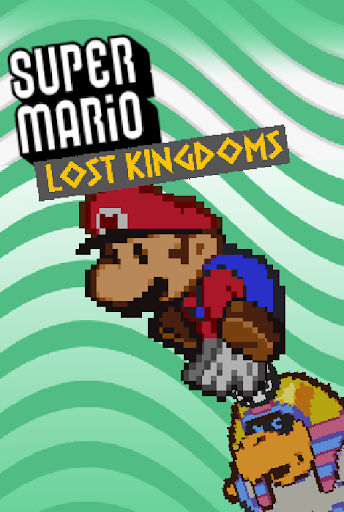

                        World Nine

                        Ninetendo

         Viaja a través de las fronteras de la mitología

                  Frontiers / Plataformero

Enlaces a la presentación

Canva 0: [[Hito
1]](https://www.canva.com/design/DAGzb2nEieU/D1J-uxTLH2PvjY1JjPl8IA/edit?utm_content=DAGzb2nEieU&utm_campaign=designshare&utm_medium=link2&utm_source=sharebutton)

Canva 1: [[Hito
2]](https://www.canva.com/design/DAG3QCwbb8M/S5ueFPO_Ns44HpqeBUyLNw/edit?utm_content=DAG3QCwbb8M&utm_campaign=designshare&utm_medium=link2&utm_source=sharebutton)

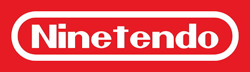
>
> **Equipo de desarrollo:**

-   Guillermo Isaac Ramos Medina

-   Ferran Escribá Cufí

-   Rodrigo Ceña Álvarez

-   Jaime Nieto Méndez

> Última Actualización: 07/11/2025

## 1.  **Resumen**

### 1.1 **Descripción**

Super Mario: Lost Kingdoms es un juego en el que Mario avanza sin
necesidad de indicaciones de dirección. Se moverá hacia la derecha y
aparecerán obstáculos y enemigos por su camino que deberán ser
confrontados. Mario podrá obtener un número de Power-Ups que darán una
ventaja al jugador e incluso habilidades para explorar zonas que antes
no se podrían. Después de cada nivel el protagonista se enfrentará a
diversos jefes que lanzarán ataques que deberán ser evitados.
### 1.2  **Género**

Plataformero y runner.

### 1.3  **Público Objetivo**

PEGI 3: capaz de jugar plataformeros, fácil de jugar pero complicado de
dominar.

### 1.4  **Setting**

Super Mario llega al mundo de la Antigua Roma por una tubería. En él
verá como el dios del inframundo Hades secuestra a su hijo Zagreus.
Mario entonces decidirá recorrer los distintos mundos basados en las
mitologías romana, egipcia y griega en ese orden. Mario correrá sin
parar hacia la derecha a través de clásicos niveles al estilo Mario,
basados en las diferentes mitologías hasta llegar al final. Sin embargo,
estos niveles estarán llenos de enemigos que tratarán de frenarle,
incluidos los mismos dioses. Aún así, gracias a diversos Power-Ups por
el nivel y a su capacidad para sobrepasarlos se podrá llegar al final de
cada nivel y completar su misión de rescatar a Zagreus.

### 1.5  **Características principales**

-   Haz que Mario salte cuanto más presiones el botón de salto, enfrenta enemigos, salta sobre plataformas para llegar al final.

-   Recoge monedas para obtener una mayor puntuación al terminar el nivel.

-   Recoge las monedas coleccionables para completar el nivel.

-   Múltiples jefes a los que enfrentarte y obtener poderes nuevos.

-   Estilo pixel art de 32 bits, con arte colorido y personajes diversos y vívidos.

## 2.  **Gameplay**

### 2.1  **Objetivo del juego**

El objetivo del juego es superar todos los niveles y conseguir la mayor
cantidad de puntos posible.

En cada nivel habrá enemigos que derrotar que darán puntos que se
sumarán al total. También se pueden esquivar, pero entonces no sumarán
puntos.

El juego termina al completar todos los niveles, derrotar a los bosses y
haber rescatado a Zagreus. La puntuación obtenida se usará para
actualizar la puntuación máxima.

### 2.2  **Core loops**

Mientras el jugador está en un nivel, el core loop es el siguiente:

1.  Evitar o derrotar a los enemigos por el camino

2.  Recoger monedas y monedas secretas.

3.  Llegar al punto más alto de la bandera

Dentro del core loop principal de juego se pueden incluir las acciones
de matar enemigos, recoger monedas y objetos para mejorar la puntuación,
con el objetivo de superar la puntuación máxima.

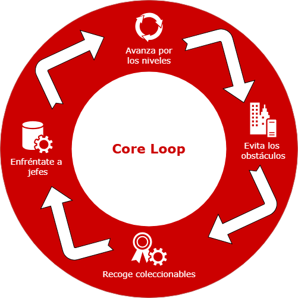

## 3.  **Mecánicas**
### 3.1  **Salto Básico**

El jugador se encarga de controlar el salto de Mario, tendrá que estar
en contacto con una superficie para realizar un salto. Si Mario salta
estando encima de un Goomba o un Koopa, dicho enemigo será eliminado. Si
Mario choca desde abajo con un bloque al saltar, tendrá diferentes
interacciones dependiendo del tipo de bloque: si es un bloque "?",
soltará lo que tenga en su interior (Power-Up, monedas, etc); si es un
bloque destructible, en caso de que Mario esté en tamaño grande, el
bloque se destruirá.

| Parámetro            | Descripción                                                 | Unidad |
|-----------------------|-------------------------------------------------------------|---------|
| Altura de salto       | Altura que salta Mario en proporción al tiempo presionado   | m       |
| Tiempo presionado     | Tiempo que tiene que presionar el jugador al botón de salto | s       |
| Altura máxima de salto| Altura máxima que puede saltar Mario                        | m       |

### 3.2  **Movimiento Horizontal**

El personaje controlado por el jugador se moverá automáticamente en la
dirección hacia la derecha. En caso de encontrarse con un obstáculo
pequeño (como un desnivel no muy alto, un goomba o un koopa.) lo saltará
automáticamente con una pequeña acrobacia. En caso de que el obstáculo
sea de mayor tamaño Mario se detendrá esperando que el jugador salte. En
caso de que el obstáculo tenga pinchos Mario caerá en la burbuja.

| Parámetro            | Descripción                                                             | Unidad |
|-----------------------|-------------------------------------------------------------|-----------|        
| Velocidad             | Velocidad máxima con la m/s que se mueve el personaje en cada dirección.| m/s      |

### 3.3  **Burbujas**

Cuando el jugador muere, ya sea por ser derrotado por enemigos o por
caer al vacío, entrará en una burbuja que arrastrará al jugador hacia el
inicio del nivel.

Durante el trayecto, el jugador puede pulsar un botón para salir de la
burbuja, y continuar el nivel en su posición actual. Siempre que el
jugador caiga dentro de la burbuja su tamaño será el más pequeño (Ver
[Tamaños de Mario]).

Hay 2 burbujas por cada nivel.

Cuando el jugador se queda sin burbujas y muere, se reinicia totalmente
el nivel.

| Parámetro            | Descripción                                                             | Unidad |
|-----------------------|-------------------------------------------------------------|-----------|        
| Velocidad             | Velocidad a la que se mueve la burbuja hacia la izquierda.| m/s      |

### 3.4  **Tamaños de Mario**

Mario tiene diferentes estados que cambian al recibir el impacto de un
obstáculo o enemigo o recogiendo un power-Up.

-   **Mario**: Su tamaño es de 1m x 1m (ancho x alto). Cualquier impacto contra un 
    objeto que haga daño llevará a Mario a la burbuja. En
    caso de coger un champiñón Mario pasará a ser Super Mario. En caso
    de coger un power-Up que no sea ni la estrella ni el champiñón
    Mario pasará a ser Mario Powered-UP.

-   **Super Mario**: Su tamaño es de 1m x 2m (ancho x alto). En caso de
    un impacto contra un objeto que haga daño Super Mario pasará a ser
    Mario. En caso de coger un power-Up que no sea ni la estrella ni
    el champiñón Mario pasará a ser Mario Powered-Up.

-   **Mario Powered-Up**: Su tamaño es de 1m x 2m (ancho x alto). En
    caso de un impacto contra un objeto que haga daño Mario Powered-Up
    pasará a ser Super Mario.

| Parámetro            | Descripción                                                 | Unidad |
|-----------------------|-------------------------------------------------------------|---------|
| Tamaño de Mario       | Altura de Mario  | m       |
| Estado de Mario     | Capacidad que tiene Mario para recibir daño sin tener que acabar en la burbuja.| unidad       |

### 3.5  **Objetos Recolectables**

Cuando Mario pasa por encima de un objeto, la recoge. Esto implica que
el objeto desaparece y suma un determinado número de puntos a la
puntuación del jugador. Al reiniciar el nivel todos los objetos vuelven
a su sitio. Todos los objetos son de 1m x 1m.

| Parámetro            | Descripción                                                 | Unidad |
|-----------------------|-------------------------------------------------------------|---------|
| Tamaño      | Tamaño del objeto recolectable  | m       |
| Puntuación    | Puntos que dan los objetos recolectables.| Números naturales      |

#### 3.5.1  **Monedas**

En cada nivel hay un cierto número de monedas que el jugador puede
recoger para aumentar su puntuación. Existen 2 Tipos:

-   Las monedas doradas: Están repartidas por el nivel y dan +100 en la
    puntuación.

-   Las monedas moradas: Hay 5 por nivel una vez conseguidas se marcará
    como obtenida al completar el nivel. Además dan 1000 de puntuación
    cada vez que se consiga una (incluidas las ya obtenidas ).

| Parámetro            | Descripción                                                 | Unidad |
|-----------------------|-------------------------------------------------------------|---------|
| Tipo de Moneda      | Tipo de monedas   | Booleano (es o no morada)       |
| Han sido recogidas (Solo para las monedas moradas)     | Valor que indica si la moneda ha sido recogida previamente. | Booleano       |
| Puntuación| Puntos que dan las monedas                        | Números naturales       |

#### 3.5.2  **Power-Ups**

Los power-ups aparecerán cuando Mario salte debajo de un bloque "?". Al
salir los objetos se desplazarán hacia la derecha. Mario recibirá un
aspecto especial en base a su power-up.

Al ser recogidos el jugador recibe +1000 puntos. Si ya había recogido un
Power-Up previamente y no lo había usado, el Power-Up que había recogido
previamente se descarta al recoger otro Power-Up.

A continuación se muestran los objetos y sus bonificaciones al jugador.
(Ver [Tamaños de Mario]).

| Nombre            | Descripción                                                 |
|-----------------------|-------------------------------------------------------------|
| Champiñón de Tamaño       | Cuando Mario está en el estado pequeño podrá consumir el champiñón para hacerse grande. (Ver Tamaños de Mario)   |
| Invencibilidad / Estrella    | Hace a Mario invencible hasta que se acabe la canción del power-up, nada le podrá dañar excepto ser aplastado o caerse al vacío. |
| Botas de salto| Aumenta el límite de salto que puede realizar Mario. (Ver salto básico)                        |
| Lanza Martillos| Pulsando el botón de acción Mario podrá lanzar unos martillos. La dirección de estos será una parábola y solamente tendrán colisión con los enemigos, siendo destruidos en impacto con ellos. Solo podrá haber un martillo en pantalla (Para limitar la cantidad de martillos seguidos)                        |
| Doble salto| Permite hacer un doble salto a Mario, cuando se acaba el doble salto se podrá seguir haciendo la vuelta en el aire.                      |

### 3.6  **Sistema de puntuación**

El jugador comienza el primer nivel con 0 puntos. El jugador gana puntos
por:

1.  Recoger monedas (Ver [Objetos Recolectables]).

2.  Matar enemigos. Todos los enemigos dan la misma puntuación de +200.

3.  Romper bloques. Cada bloque da +10 de puntuación.

4.  Recoger un objeto. Cada objeto proporciona una puntuación diferente
    (Ver [Objetos Recolectables]).

5.  La puntuación de la bandera (Cuanto más arriba la barra mayor es la 
    puntuación).

6.  El tiempo restante. Cada segundo restante da +100 de puntuación.

La puntuación se pasa de un nivel al siguiente. Al terminar la partida,
la puntuación máxima es actualizada con la puntuación conseguida por el
jugador en la última partida.

| Parámetro            | Descripción                                                 | Unidad |
|-----------------------|-------------------------------------------------------------|---------|
| Puntos       | Registran y cuantifican las acciones del jugador. No afectan directamente a la progresión del juego   | Números naturales       |

## 4.  **Interfaz**

### 4.1  **Controles**

Los controles del juego son los siguientes:

-   Clic izquierdo: el jugador salta.

-   Clic derecho: el jugador usa el Power-up que tiene. Si no tiene
    ninguno, no hace nada.

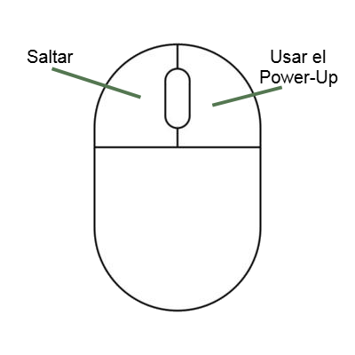

### 4.2  **Cámara**

La cámara sigue al jugador progresivamente a lo largo del nivel, aunque
mantiene el mismo nivel de zoom.

### 4.3  **HUD**

El HUD contiene información sobre:

-   Nº de Monedas Doradas

-   Tiempo Restante

-   Nº de Monedas Moradas

-   Puntuación actual

-   Nº de burbujas restantes

### 4.4  **Menús**

El juego tiene una primera pantalla de título. Al pasar de dicha
pantalla, se llega a la pantalla de selección de nivel, donde el
jugador, como su propio nombre indica, seleccionará el nivel que quiere
jugar (aunque los debe desbloquear primero completándolos en orden).
Finalmente, se encuentran los propios niveles.

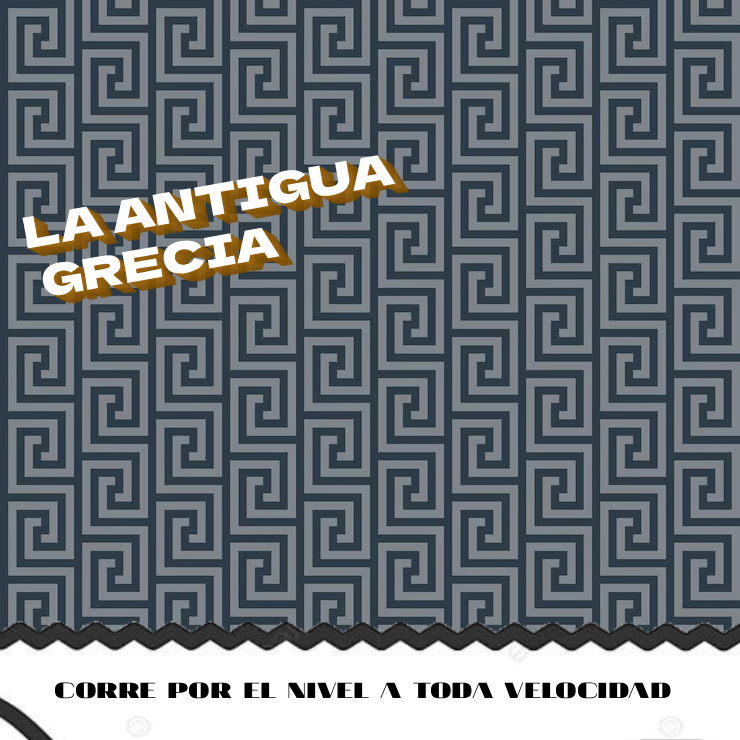
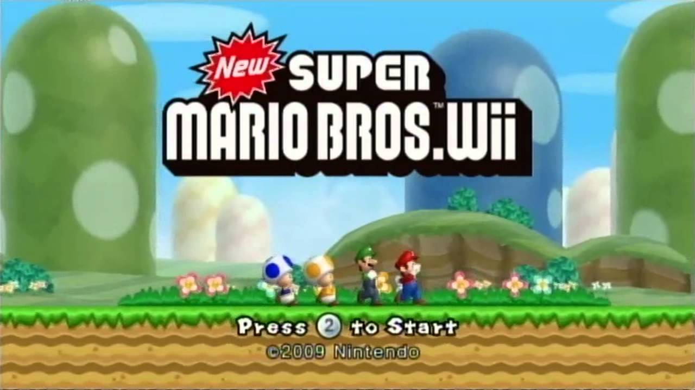
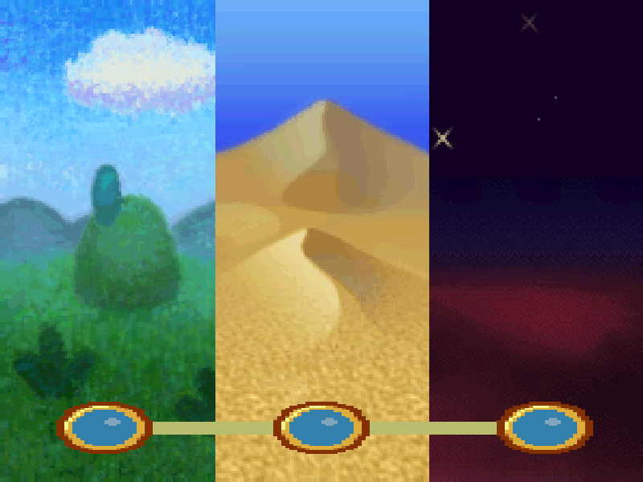
<!-- 

 -->

(*Imagenes provisionales para servir de ejemplo*)

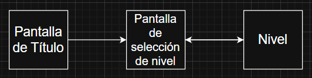

## 5.  **Mundo del juego**

### 5.1  **Personajes**

#### 5.1.1  **Mario**

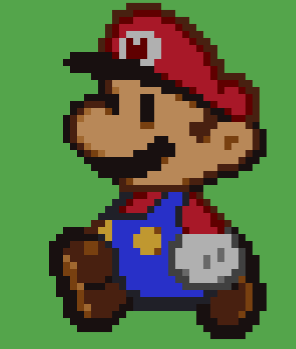
Mario es el protagonista del juego y es la representación del jugador
dentro del juego. Su comportamiento se describe en la sección de
[mecánicas]. Las dimensiones de Mario se describen en [Tamaños de
Mario].

#### 5.1.2  **Zagreus**

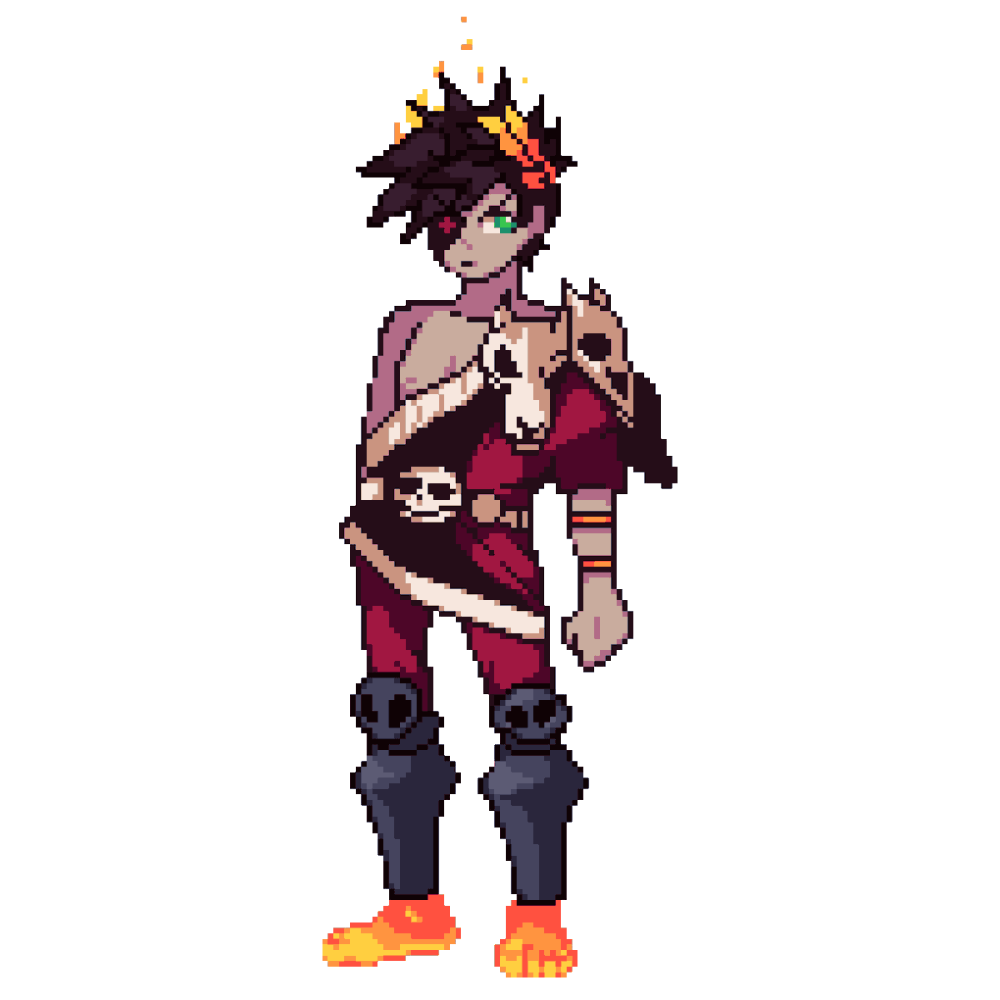
Zagreus actúa como la clásica damisela en peligro (Princesa Peach) de 
los juegos de Mario. Sirve como motivación para que Mario se embarque 
en la aventura.

#### 5.1.3  **Enemigos**

Dentro del juego hay varios tipos de enemigos que pueden matar al
jugador. Todos tienen un conjunto de comportamientos comunes:

-   Si un enemigo colisiona con el jugador, le hace daño (ver [Tamaños 
    de Mario]).

-   Si Mario salta encima del enemigo, lo elimina (ver 
    [Salto]) y aumenta la 
    puntuación del jugador. Cada enemigo da una puntuación diferente.

-   Los enemigos aparecen en posiciones fijas preestablecidas al comenzar cada nivel.

-   Se mantienen inmóviles hasta que no aparezcan en pantalla.

A continuación se describen las particularidades de cada tipo de enemigo
del juego:

##### 5.1.3.1   **Goomba**

Se mueve en horizontal hacia la izquierda, dándose la vuelta cuando
encuentra un obstáculo.

| Parámetro            | Descripción                                                 | Unidad |
|-----------------------|-------------------------------------------------------------|---------|
| Velocidad      | Velocidad máxima con la que se mueve el enemigo.   | m/s       |
| Puntos    | Puntuación otorgada al ser derrotado por el jugador | Número natural       |

##### 5.1.3.2   **Koopa**

Se mueve igual que el Goomba, pero cuando Mario salta encima, lanza su
caparazón hacia la derecha, eliminando a los enemigos que haya por el
camino.

| Parámetro            | Descripción                                                 | Unidad |
|-----------------------|-------------------------------------------------------------|---------|
| Velocidad      | Velocidad máxima con la que se mueve el enemigo.   | m/s       |
| Puntos    | Puntuación otorgada al ser derrotado por el jugador | Número natural       |

3.   **Pokey**

Se mueve muy lento y se compone de varias bolas de pinchos encima las
unas de las otras que conforman su cuerpo, hasta llegar a la cabeza. Al
dar con un Power-Up, como el martillo, a una de las bolas que no sea la
cabeza, esta se destruirá y el Pokey será menos alto. Si se le da en la
cabeza, será destruido entero.

| Parámetro            | Descripción                                                 | Unidad |
|-----------------------|-------------------------------------------------------------|---------|
| Velocidad      | Velocidad máxima con la que se mueve el enemigo.   | m/s       |
| Puntos    | Puntuación otorgada al ser derrotado por el jugador | Número natural       |
| Cantidad del cuerpo      | Número de bolas que tiene que no son la cabeza   | Número natural        |
| Tamaño del cuerpo    | Dimensión que ocupa en el espacio con las bolas | m       |

##### 5.1.3.4   **Planta Piraña**

Sale de las tuberías periódicamente y daña a Mario si entran en
contacto. Se destruye al ser golpeada con el Power-Up del martillo.

| Parámetro            | Descripción                                                 | Unidad |
|-----------------------|-------------------------------------------------------------|---------|
| Tiempo escondido en la tubería      | Tiempo en el que permanecerá en la tubería   | s       |
| Tiempo fuera de la tubería    | Tiempo en el que permanecerá fuera de la tubería | s       |
| Puntos      | Puntuación otorgada al ser derrotado por el jugador   | Número natural        |

#### 5.1.4  Bosses

Enemigos que se encuentran al final de cada nivel, respectivamente.
Todos ellos comparten ciertas características:

-   Se encuentran alejados del movimiento del jugador, podrán
    desplazarse por el escenario y Mario no podrá chocarse con ellos.

-   Van invocando enemigos a medida que avanza la pelea.

-   Es necesario sobrevivir un determinado tiempo contra ellos para 
    finalizar el nivel.

##### 5.1.4.1 **Júpiter**

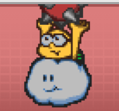
Es el primer boss. Su escenario tendrá 3 caminos entre los que Mario
puede ir alternando. Cada cierto tiempo, Júpiter se preparará para
lanzar un rayo en uno de los caminos. Dicho rayo será precedido por una
línea de predicción durante la carga del mismo, para avisar al jugador y
que lo pueda esquivar. El tiempo de carga del rayo se irá reduciendo a
medida que se avanza en la pelea. Además, invocará enemigos
característicos de su nivel correspondiente.

| Parámetro            | Descripción                                                 | Unidad |
|-----------------------|-------------------------------------------------------------|---------|
| Duración del rayo      | Tiempo de existencia del rayo lanzado por el boss antes de desaparecer.   | s       |
| Duración de la carga del rayo    | Tiempo de existencia de la línea de predicción del rayo antes de desaparecer. | s       |
| Duración de la pelea      | Tiempo que debe sobrevivir el jugador en la pelea para finalizar el nivel.   | s        |

##### 5.1.4.2  **Horus**

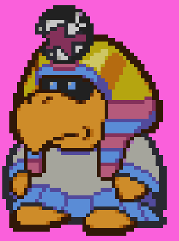
Es el segundo boss. Irá moviendo columnas usando sus poderes de viento
con el objetivo de frenar al jugador, pero el viento también arrastrará
Koopas, cuyos caparazones al ser lanzados contra la columna abrirán
huecos para que el jugador pueda pasar. También podrá enviar columnas
con huecos que el jugador podrá atravesar para evitarlas, sin necesidad
de romperlas previamente. Además, invocará enemigos característicos de
su nivel.

| Parámetro            | Descripción                                                 | Unidad |
|-----------------------|-------------------------------------------------------------|---------|
| Velocidad de las columnas      | Velocidad a la que se mueven las columnas enviadas por el boss.   | m/s       |
| Cantidad de columnas por oleada    | Cantidad de columnas que envía el boss cada vez que realiza el ataque. | Número natural       |
| Duración de la pelea      | Tiempo que debe sobrevivir el jugador en la pelea para finalizar el nivel.   | s        |

##### 5.1.4.3  **Hades**

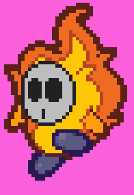
Es el último boss. Su escenario será por un camino lleno de obstáculos
mientras el jugador es perseguido por una columna de almas que podrán en
la burbuja al jugador al tocarlo. Si el jugador choca con los
obstáculos, la columna de almas se acercará más. A su vez, Hades lanzará
fuegos fatuos al jugador, que le ralentizarán al contacto. Además,
invocará enemigos característicos de su nivel.

| Parámetro            | Descripción                                                 | Unidad |
|-----------------------|-------------------------------------------------------------|---------|
| Velocidad de la columna de almas     | Velocidad a la que se mueve la columna de almas que persigue al jugador durante la pelea.   | m/s       |
| Velocidad de los fuegos fatuos    | Velocidad a la que se mueven los fuegos fatuos que lanza el boss. | m/s       |
| Porcentaje de ralentización de los fuegos      | Porcentaje de ralentización que se aplicará al jugador tras tocar un fuego fatuo.   | Número natural        |
| Tiempo de ralentización del jugador    | Tiempo que estará ralentizado el jugador tras ser tocado por un fuego fatuo. | s       |
| Duración de la pelea      | Tiempo que debe sobrevivir el jugador en la pelea para finalizar el nivel.   | s        |

### 5.2  **Obtención de power-Ups**

Los power-ups aparecerán cuando Mario salte debajo de un bloque "?". Al
salir los objetos se desplazarán hacia la derecha. Todos los objetos
tendrán unas dimensiones de 1m x 1m. Todos proporcionarán la misma
cantidad de puntos a la hora de ser recogidos. A excepción del champiñón
y de la estrella de invencibilidad sólo se podrá tener equipado un
power-up a la vez, eso es que cuando se recoge un objeto nuevo el que se
tenía equipado previamente dejará de ser equipado. Cuando el jugador sea
dañado se quitará el power-up, si es dañado con el champiñón mario
reducirá su tamaño, al ser dañado en ese estado volverá a una parte
anterior del nivel en una burbuja, el jugador podrá salir de esta
burbuja en su estado reducido al pulsar el botón de salto.

### 5.3  **Objetos del escenario**

| Objeto            | Descripción                                                 |
|-----------------------|-------------------------------------------------------------|
| Bloques “?” que dan objetos / Power-Ups       | Bloques que al saltar contra ellos generan un objeto / Power-Up. Mario deberá darle con la cabeza al bloque para que suelte un objeto. El bloque soltará un champiñón si Mario está en su estado pequeño, si no, soltará un power up aleatorio (incluyendo el champiñón).   |
| Bloques destructibles    | Bloques que al saltar contra ellos se destruyen. Solo se pueden destruir si Mario es de tamaño grande. Sin embargo, pueden contener monedas u objetos, sin importar el estado de Mario que soltarán un objeto si Mario salta debajo de estos. |
| Champiñones saltarines| Champiñones que hacen saltar a Mario al entrar en contacto con ellos. El salto podrá ampliarse si Mario pulsa el botón de salto al entrar en contacto con el champiñón.                        |
| Pinchos| Al entrar en contacto, si Mario era de tamaño grande pasa a ser de tamaño pequeño, si Mario era de tamaño pequeño se va en una burbuja hacia atrás hasta que el jugador pulse la tecla de salto para salir de esta.                       |
| Hielo| Al caminar sobre hielo el movimiento de Mario es más rápido, los enemigos también caminarán más rápido sobre el hielo.                      |
| Rampas       | Hacia arriba, los personajes jugables y no jugables caminarán más lento. Hacia abajo, Mario se deslizará por la rampa, pudiendo dañar a los enemigos presentes en la rampa, los enemigos caminarán más rápido en la rampa hacia abajo.   |
| Plataformas que se caen       | Plataformas que se caen cuando Mario pasa sobre ellas, estas se regeneran si Mario entra en su estado burbuja.   |
| Bloque Pausa       | Al estar sobre este bloque, Mario se detiene un instante para ver la parte derecha de la pantalla, el temporizador del nivel se detendrá también.   |
| Bloque que al pasar sobre él muestra un camino de monedas       | Cuando Mario colisiona sobre este bloque (no tiene físicas, se atravesará), se muestra un camino de monedas. Si no se pasa sobre este bloque, esas monedas no se podrán conseguir.   |
| Orbe de salto extra (tres intensidades)       | Al pulsar el botón de salto sobre alguno de estos orbes Mario realizará un salto extra. Habrá tres intensidades con diferentes alturas.   |

### 5.4  **Niveles**

Los niveles serán bellos y variados. Serán una composición con
obstáculos y enemigos característicos del nivel en el que nos
encontremos.

Después de cada nivel estará esperando un jefe con una serie de ataques
que se deberán evitar, si se sobrevive lo suficiente se completará el
jefe.

## 6. Experiencia de juego

El juego empieza con un tutorial por la escena de un nivel de Mario,
pudiendo ver al protagonista, al fondo y al suelo por el que tendrá que
caminar.

Cada elemento que sale en la interfaz de la pantalla aumenta cuando se
realiza una determinada acción como derrotar enemigos, recoger
[monedas] y objetos. Las
[burbujas] sólo podrán disminuir, ya
sea cuando el jugador es dañado en su estado pequeño o cuando se caiga
al vacío.

En la siguiente imagen se muestra una idea de lo que podrá ver el
jugador durante el nivel, se mostrarán el número de
[burbujas] que tiene, su
[puntuación], número de
[monedas], secretas y generales de
cada nivel, y, el tiempo que tiene para completar el nivel.

Durante el nivel también se podrán recoger unos
[power-ups] que proporcionarán
habilidades específicas al jugador, ayudando a que la experiencia sea
más amena, incluso dando posibilidad a descubrir caminos secretos para
recoger [monedas especiales].

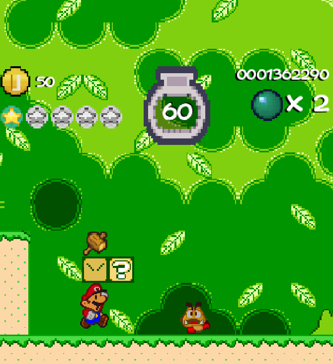

**Boceto con la idea general del juego (no completo), se incluye:**

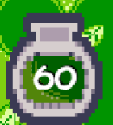**Sistema de límite de tiempo**

**Monedas generales del nivel**

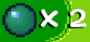**Límite de burbujas del nivel**

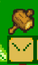**Recogida de
power-ups a partir de un bloque**

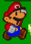**Salto del personaje**

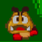**Movimiento de los enemigos**

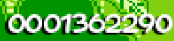**Puntuación total del nivel**

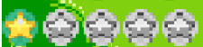**Monedas secretas recogidas**

Después de cada nivel principal se interpondrá un jefe acorde a cada
mitología. El jugador deberá de evitar sus ataques durante un cierto
periodo de tiempo. Los ataques que realizará el boss se avisarán
previamente por un indicativo visual y auditivo para la capacidad de
reacción del jugador.

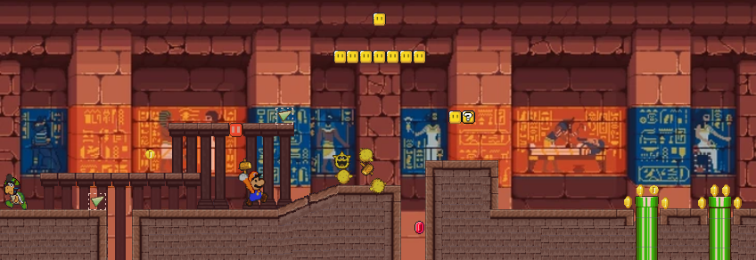

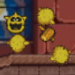**Destrucción
por bolas enemigo pokey**

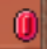**Moneda Secreta**

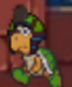**Decoración enemigos**

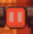**[Bloque
pausa]**

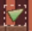**[Bloque aparición
monedas]**

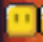**Bloques destructibles**

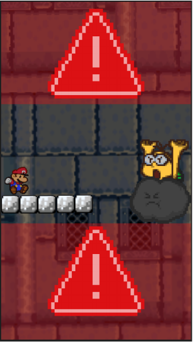

#  

### 6.1 Experiencia de cada nivel

**Nivel tutorial:**

Durante este nivel el jugador tendrá que aprender las habilidades
básicas como saltar, obtener y usar power-ups, saltar sobre enemigos y
hacerse al movimiento del jugador.

El jugador no tendrá tiempo límite en este nivel y no se terminará este
hasta que se llegue a la bandera del final. Este nivel se compondrá de
una serie de obstáculos y bloques que impedirán el paso del jugador
hasta que no se haya realizado una determinada acción.

También habrán monedas escondidas para indicar que los niveles son
explorables en cierta manera que incentiva a recoger objetos.

Al final de este se reproducirá una cinemática en la que Mario se
transportará a una tubería hasta el mundo de la antigua Roma, en la que
se verá cómo Zagreus es secuestrado.

**Primer nivel**:

En este nivel los enemigos tendrán una apariencia similar a los Romanos,
atacando como los enemigos de Mario para que no pille al jugador de
sorpresa, pudiendo introducir una nueva mecánica del escenario para
hacer variada la experiencia de juego.

**Boss 1:**

El primer jefe del juego será el más corto, indicando previamente dónde
llegarán los ataques que se lanzarán al jugador. Para completarlo será
necesario sobrevivir una serie de ataques, dando paso a la siguiente
mitología.

**Segundo nivel:**

El segundo nivel introducirá dos mecánicas nuevas asociadas a la
mitología egipcia, con ello se podrá desbloquear otro power-up y
seguidamente continuar con el nivel con otra estética y escenografía, al
igual que los enemigos.

**Boss 2:**

Tutankoopa modificará el escenario y Mario tendrá que ser capaz de
evitar los obstáculos, dando paso a la siguiente mitología.

**Tercer nivel:**

Este último nivel estará ambientado en la antigua grecia, será el nivel
más difícil de todos, con plataformas precias, caminos complicados y
monedas escondidas a través de un camino secreto. Al final de este
estará esperando el boss final del juego.

**Boss 3:**

El tercer boss aplicará todas las mecánicas introducidas anteriormente y
durará significativamente más que el primero. Al aguantar lo suficiente
Zagreus nos estará esperando encerrado y se reproducirá la cinemática
final.

## 7. Estética y contenido

Se tratará de 3 niveles distintos, junto con su salas de bosses después
de cada nivel, cada una con su estética inspirada en las mitologías
romanas, egipcias y griegas. Los sprites serán de 32 píxeles.

Además de eso, adaptamos unos enemigos de Mario a la mitología en la que
se sitúan. En la egipcia serán ambientados en el paisaje arenoso y
ardiente, en la griega adaptamos al dios del trueno junto con otros
elementos como los martillos que fabricaría hefesto, y, en la griega
adaptamos al infierno.

En la parte sonora, se implementarán sonidos característicos de Mario
cuando se salta, se rompe un bloque, se obtiene un power-up, cuando se
usa una habilidad, cuando se recibe daño, cuando se lanza un martillo,
en los menús, entre otros. Además, la música intentará ser una mezcla de
Mario y del paisaje mitológico en el que se encuentra.

Entre los efectos aplicados serán: humo, chispas y efectos de impacto.
Cada uno de estos efectos aparecerán cuando se realice una acción como
correr, saltar, derrotar enemigos y recoger monedas.

Las animaciones del jugador van a ser: correr, saltar, caer, saltar
encima de algo, recoger un power-up, lanzar un martillo, ser dañado,
además de los enemigos que estarán presentes por el nivel y el fondo y
los bosses.

## 8.  **Producción**

### 8.1  **Planificación (roadmap)**

[**[RoadMapW9]**](https://docs.google.com/spreadsheets/d/14TWWS0c-vvL7ow5dCLY1PFPF8hPG8OodMv74Icd5OO4/edit?gid=272136489#gid=272136489)

## 9.  **Referencias**

Estas son las referencias usadas para entender este documento.

-   Estética y decoración \_ [[Super Mario\'s Wacky Worlds, Philips, 
    Cancelado]](https://archive.org/details/super-marios-wacky-worlds-cd-i-beta-all-levels)

-   Algunos de los objetos de interacción con el escenario \_ [[Geometry Dash, RobTop Games,
    2013]](https://es.wikipedia.org/wiki/Geometry_Dash)

-   Principal bucle de juego y mecánicas \_ [[Super Mario Run, Nintendo, 2016]](https://es.wikipedia.org/wiki/Super_Mario_Run)

-   Inspiración de los niveles bosses \_ [[RayMan Legends, Ubisoft, 2013]](https://www.youtube.com/watch?v=yT6XOfy2gEE)

-   Ideas de estética y mecánicas para boss \_ [[Cuphead: Djimmi the Great Boss Fight #7]](https://www.youtube.com/watch?v=O7Ti2DqPpRM)

## 10. **Fechas Importantes y Requerimientos de Entregas**

-   Hito 0 *(Fecha Límite)* : 26 de septiembre 23:59 CEST

    -   Pdf: [No hay] *(Requisitos abajo)*

        -   Las 4 cartas a utilizar (código de carta y nombre de carta).

            -   Mario (P15)

            -   Fez (M11)

            -   Mitología (A22)

            -   Zagreus (P18)

        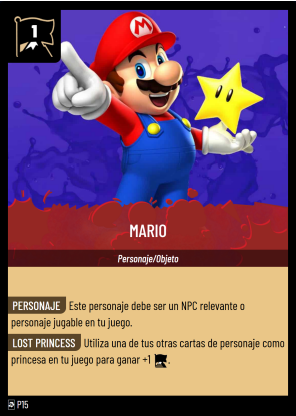 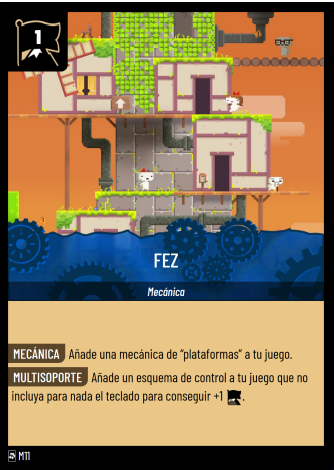 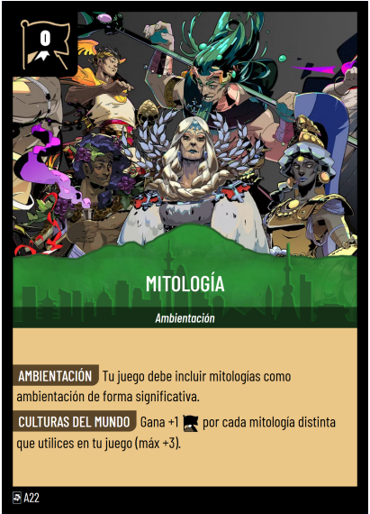 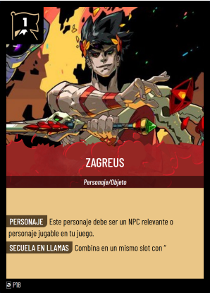

-   Resumen de la idea del juego:

    -   Super Mario: Lost Kingdoms es un juego en el que Mario avanza
        sin necesidad de indicaciones de dirección. Se moverá hacia la
        derecha y aparecerán obstáculos y enemigos por su camino que
        deberán ser confrontados. Mario podrá obtener un número de
        Power-Ups que darán una ventaja al jugador e incluso
        habilidades para explorar zonas que antes no se podrían.
        Después de cada nivel el protagonista se enfrentará a diversos
        jefes que lanzarán ataques que deberán ser evitados.

-   [[Enlace a Github con el repositorio del proyecto]](https://github.com/Janime-UCM555/PVLI_WorldNine).

#

-   Hito 1 *(Fecha Límite)* : 03 de octubre 0:00 CEST

    -   Presentación: [~~[enlace]~~](https://www.canva.com/design/DAGzb2nEieU/D1J-uxTLH2PvjY1JjPl8IA/edit?utm_content=DAGzb2nEieU&utm_campaign=designshare&utm_medium=link2&utm_source=sharebutton) *(Requisitos abajo)*

        -   Miembros del grupo

        -   Nombre del estudio (definitivo)

        -   Nombre del juego (puede ser nombre en clave o ser el definitivo)

        -   Género(s) de juego

        -   Objetivo de juego y Mecánicas

        -   Estilo gráfico, lore, narrativa\...

        -   Público objetivo del juego (edad, perfil de jugador\...)

        -   Juegos similares o que sirven como inspiración

        -   Redes sociales y enlace al repositorio GitHub donde se trabajará

        -   Cada grupo tendrá un máximo de 7 minutos para presentar, y se usará la sesión del viernes para presentar en el aula.

    -   Entrega en el Campus Virtual:

        -   Solo debe entregar un miembro del grupo

        -   Las diapositivas o recursos que se utilizarán durante la
            presentación en PDF. Además podrá subirse un archivo con
            un enlace (a Google Drive u otra plataforma). Es
            obligatorio que aparezca el enlace al repositorio GitHub
            creado. ([Es el mismo enlace que el apartado de
            encima.]{.underline})

        -   El GitHub debe contener un PDF con las principales ideas del
            proyecto (borrador de GDD con el mayor número de detalles
            posibles hasta el momento, aunque aún no tiene porqué
            tener una estructura clara. Debería haber imágenes sobre
            cómo será el juego que pueden ser fotos de bocetos hechos
            a mano). ([Este mismo Documento]{.underline})

        -   La página web: [[https://janime-ucm555.github.io/PVLI_WorldNine/]](https://janime-ucm555.github.io/PVLI_WorldNine/) (.io en Github Pages) debe contener los siguientes elementos:

            -   Título del juego y nombre del estudio

            -   Descripción breve del juego

            -   Autores y Créditos

            -   Redes sociales y enlace al repositorio de Github

-   Hito 2 *(Fecha Límite)* : 07 de noviembre 16:00 CET

Objetivo: Presentar el avance realizado en el proyecto (primeras
mecánicas implementadas y web).

La presentación en clase debe contener al menos:

-   La idea general del juego, con género, objetivo, mecánicas, dinámicas y demás.

-   Mostrar el diseño de algún nivel y pantalla de juego (pueden ser bocetos, pero deben ser claros)

-   Explicar la narrativa del juego de forma breve.

-   Qué se ha desarrollado hasta el momento.

-   Plan de lo que falta por desarrollar.

-   Demo corta, con lo que haya hasta el momento.

Cada grupo tendrá un máximo de 7 minutos para presentar, y se usará la esión del viernes para presentar en el aula. Deben estar todos los integrantes del grupo que presenta en la tarima (aunque no todos hablen) - excepto causa justificada.

Antes del día de la presentación el repositorio debe estar actualizado
con:

-   La siguiente estructura:

    -   index.html, con la página web del proyecto (el archivo que se verá al activar GitHub pages)

    -   /src, con el código

    -   /assets, con los recursos de audio, vídeo, mapas y demás (debidamente organizados)

    -   README.md, el archivo en [Markdown](https://guides.github.com/features/mastering-markdown/) (.md \--\> Markdown) que se verá en la raíz de la página del repositorio. Tiene que contener lo siguiente:

        -   Que el proyecto es un trabajo universitario

        -   Redes sociales creadas para el proyecto (opcional)

        -   Una descripción general del proyecto

        -   Capturas del juego

        -   [Un enlace a la página web pública con la versión de publicación del juego]{.underline}

    -   GDD.md, el *game design document* (puede formar parte del README.md)

    -   assets.md, descripción de los assets, las decisiones de dirección artística y donde se han obtenido. 
        En caso de los assets propios debe indicarse la licencia ya sea propietaria o libre (puede formar parte del README.md)

    -   La página web (.io) debe contener los siguientes elementos:

        -   Título del juego y nombre del estudio

        -   Canvas en el que se ejecuta el juego (importante que se ejecute el juego).

        -   Instrucciones del juego (objetivo y controles)

        -   Descripción breve del juego

        -   Autores y Créditos

        -   Redes sociales y enlace al repositorio de Github

> Además es obligatorio que a estas alturas el proyecto aparezca ya en
> el [Histórico de
> Proyectos](https://cvdof.ucm.es/moodle/mod/wiki/view.php?id=279615).
>
> ¿Qué se debe entregar?

-   Las diapositivas o recursos que se utilizarán durante la presentación en PDF. Además podrá subirse un archivo con un enlace (a GoogleDrive u otra plataforma).

> Además,debe realizarse la entrega individual \"Aportación de cada
> miembro - Hito 2\"
>
> ¿Insignias relacionadas?
>
> 6 insignias relacionadas con:

-   Presentación en clase (diapositivas y ponencia claras, que cumpla el objetivo de la presentación, y que consiga enganchar a la audiencia)

-   Web en Github (desplegada, con toda la información, agradable visualmente y consistente con la idea e juego).

-   Repositorio y código (Repositorio bien estructurado, coherente, código documentado, y avances significativos en el juego)

-   Documentación (Documentación detallada, bien formateada y legible)

-   Tiempo de Entrega (Realizar la entrega 36h antes y no tener cambios desde entonces hasta después de la defensa del Hito)

-   Redes sociales (Publicaciones, teniendo que existir algunas relacionadas con el proyecto y su avance, y la asignatura)
